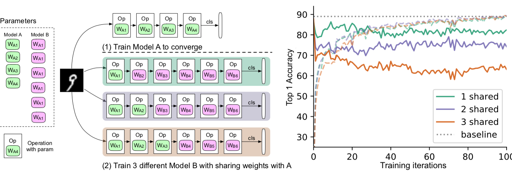
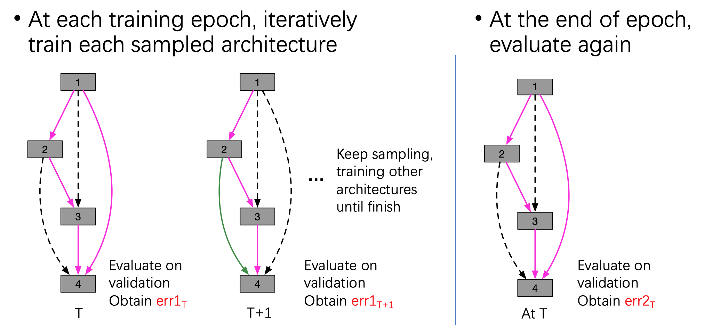

# Overcoming multi-model forgetting: Weight plasticity loss in Pytorch  
> Code for ICML 2019 Paper: [Overcoming multi-model forgetting](https://arxiv.org/abs/1902.08232)

```text
@InProceedings{benyahia2019overcoming,
  title={Overcoming Multi-Model Forgetting},
  author={Benyahia, Yassine and Yu, Kaicheng and Bennani-Smires, Kamil and Jaggi, Martin and Davison, Anthony and Salzmann, Mathieu and Musat, Claudiu},
  booktitle = {Proceedings of the 36th International Conference on Machine Learning},
  year={2019}
}
```

## Introduction

In neural networks, if you iteratively train two model A and B, where these two models share some parameters, the neural 
brainwashing phenomenon will occur, and drastically decrease the performance of the network.
 


To tackle this, we propose a statistically-motivated penalization of the shared weights, and named it as **Weight 
Plasticity Loss** (WPL). It will significantly reduce the brainwashing effect as shown in one simple example case. 


In this repository, we provide the implementation of Weight Plasticity Loss, within a simple example as well as the 
real world application, neural architecture search with shared parameters.  

## Application: Neural architecture search with weight sharing
We based on the implementation of [Efficient Neural Architecture Search via Parameters Sharing](https://arxiv.org/abs/1802.03268), 
create our own repo on top of it.

**[Caveat] Thanks to breaden, we build our code repo on top of it.: [link](https://github.com/melodyguan/enas)**
**[Caveat] Here is the Document: [link](https://docs.google.com/document/d/1Fs2qVyzweDsSmoJK0m_tyMtnDBWOUDbt5esEIpCOtIY/edit?usp=sharing)**

**ENAS** reduce the computational requirement (GPU-hours) of [Neural Architecture Search](https://arxiv.org/abs/1611.01578) (**NAS**) by 1000x via parameter sharing between models that are subgraphs within a large computational graph. 

In principle, ENAS sample a sequence of sub-models, whose architectures are different but the parameters are shared. 
. 
If `diff = err2 - err1 > 0`, such forgetting indeed occurs in the training scheme of ENAS. 

Results are shown in the following figure.

We observed that, multi-model forgetting indeed happened during the training and our WPL will significantly reduce such side-fact, and benefit the final searching model.

## Prerequisites

- Python 3.6+
- [PyTorch](http://pytorch.org/) = 0.4.1
- tqdm, scipy, imageio, graphviz, tensorboardX

## Quick start

Install prerequisites with:

    conda install graphviz
    pip install -r requirements.txt

To train **ENAS** to discover a recurrent cell for RNN:

```bash
python \
main.py --comment='rnn-train' \
     --train_controller=True \
     --start_training_controller=1 \
     --start_using_fisher=5 \
     --max_epoch=150 \
     --shared_max_step=60 \
     --save_epoch=30 \
     --fisher_clip_by_norm=10.0 \
     --alpha_fisher=60.0 \
     --alpha_decay=1. \
     --alpha_decay_after=15 \
     --set_fisher_zero_per_iter=2 \
     --policy_batch_size=1 \
     --controller_max_step=2000 \
     --num_blocks=12 \
     --num_batch_per_iter=7 \
     --alpha_decay=1. \
     --alpha_decay_after=15 \
     --alpha_small_scale=.0001 \
     --reward_c=80
```


To train **ENAS** to discover Micro-CNN architecture, with help of WPL:
       
```bash
python main.py \
    --comment='cnn-train' \
    --dataset='cifar10' \
    --network_type='micro_cnn' \
    --num_blocks=5 \
    --cnn_num_repeat_normal=5 \
    --batch_size=32 \
    --test_batch_size=16 \
    --train_controller=True \
    --start_using_fisher=50000 \
    --start_training_controller=2 \
    --max_epoch=310 \
    --controller_max_step=100 \
    --save_epoch=10 \
    --fisher_clip_by_norm=10.0 \
    --momentum=False \
    --alpha_decay_mode=1 \
    --alpha_fisher=60.0 \
    --alpha_decay=1. \
    --alpha_decay_after=15 \
    --num_batch_per_iter=7 \
    --set_fisher_zero_per_iter=3 \
    --stop_training_controller=1000 \
    --nb_batch_reward_controller=20 \
    --log_level='INFO' \
    --entropy_coeff=0.0001 \
    --controller_lr=0.0035 \
    --controller_max_step=1000 \
    --policy_batch_size=1 \
    --shared_max_step=70 \
    --reward_c=1. \
    --ema_baseline_decay=0.99 \
    --softmax_temperature=8. \
    --resume=True \
    --resume_with_new_params=False
```

or you can use your own dataset by placing images like:

    data
    ├── YOUR_TEXT_DATASET
    │   ├── test.txt
    │   ├── train.txt
    │   └── valid.txt
    ├── YOUR_IMAGE_DATASET
    │   ├── test
    │   │   ├── xxx.jpg (name doesn't matter)
    │   │   ├── yyy.jpg (name doesn't matter)
    │   │   └── ...
    │   ├── train
    │   │   ├── xxx.jpg
    │   │   └── ...
    │   └── valid
    │       ├── xxx.jpg
    │       └── ...
    ├── image.py
    └── text.py

To generate `gif` image of generated samples:

    python generate_gif.py --model_name=ptb_2018-02-15_11-20-02 --output=sample.gif

More configurations can be found [here](config.py).


## References

- [Neural Architecture Search with Reinforcement Learning](https://arxiv.org/abs/1611.01578)
- [Neural Optimizer Search with Reinforcement Learning](https://arxiv.org/abs/1709.07417)

## Author

Yassine Benyahia / [@Wronskia](https://github.com/Wronskia)
Kaicheng Yu / [@kcyu2014](https://scholar.google.de/citations?hl=de&user=j9OguiIAAAAJ)

These two authors contributes equally. 
